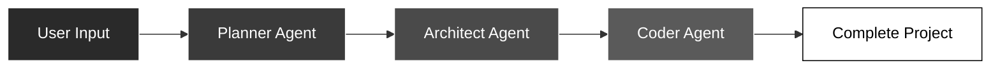

# AutoDev AI

<div align="center">


**Transform Ideas into Production-Ready Code, Instantly**

[](https://www.python.org/downloads/)
[](https://streamlit.io/)
[](https://github.com/langchain-ai/langgraph)
[](https://groq.com/)
[](LICENSE)

[**Live Demo**](https://autodev-ai.streamlit.app/) • [**Documentation**](#-documentation) • [**Quick Start**](#-quick-start) • [**Features**](#-features)

</div>

---

## 🌟 Overview

**AutoDev AI** is a cutting-edge autonomous code generation platform powered by a multi-agent AI system. Simply describe your project in natural language, and watch as specialized AI agents collaborate to build complete, production-ready applications from scratch.

From web apps and games to utilities and dashboards - AutoDev AI handles the entire development lifecycle: planning, architecture, and implementation. No boilerplate, no templates, just intelligent code generation tailored to your requirements.

### ✨ What Makes AutoDev AI Different?

- **Multi-Agent Architecture** - Three specialized AI agents work in harmony
- **Professional Glassmorphism UI** - Modern, deployment-ready interface
- **Real-Time Progress Tracking** - Watch your project materialize step-by-step
- **Secure API Key Management** - Built-in password-protected input field
- **One-Click Deployment** - Download complete projects as ZIP files
- **Adaptive Complexity** - Adjustable intelligence levels from simple to advanced

---

## 🎯 Key Features

### 🤖 Intelligent Multi-Agent System



1. **Planner Agent** - Analyzes requirements and creates comprehensive project roadmap
2. **Architect Agent** - Designs file structure and defines component dependencies  
3. **Coder Agent** - Implements production-ready code with best practices

### 🎨 Professional UI Design

- **Glassmorphism Cards** - Modern frosted-glass aesthetic
- **Dark Theme** - Professional black/white/grey color scheme
- **Responsive Layout** - Optimized for all screen sizes
- **Smooth Animations** - Polished user experience
- **Accessibility** - WCAG compliant design

### 🔐 Secure Configuration

- Password-protected API key input
- Session-based key storage
- No hardcoded credentials
- Environment variable fallback support

---

## 🚀 Quick Start

### Prerequisites

- **Python 3.11+** ([Download](https://www.python.org/downloads/))
- **Groq API Key** ([Get Free Key](https://console.groq.com/keys))
- **Git** (for cloning the repository)

### Installation

```bash
# Clone the repository
git clone https://github.com/NamanKundan/AutoDev_AI.git
cd AutoDev_AI

# Create virtual environment (recommended)
python -m venv .venv

# Activate virtual environment
# Windows:
.\.venv\Scripts\activate
# macOS/Linux:
source .venv/bin/activate

# Install dependencies
pip install -r requirements.txt
```

### Configuration

**Option 1: UI Input (Recommended)**
1. Launch the app
2. Click "Configuration" expander
3. Enter your Groq API key in the password field
4. Start generating projects!

**Option 2: Environment File**
```bash
# Create .env file
cp .sample_env .env

# Edit .env and add your API key
GROQ_API_KEY=your_groq_api_key_here
```

**Option 3: Streamlit Secrets**
```bash
# Create secrets file
mkdir .streamlit
cp .streamlit/secrets.toml.example .streamlit/secrets.toml

# Edit secrets.toml
GROQ_API_KEY = "your_groq_api_key_here"
```

### Launch

```bash
streamlit run app.py
```

Navigate to `http://localhost:8501` in your browser.

---

## 📖 Documentation

### How to Use

1. **Enter API Key** (if not configured via environment)
2. **Set Complexity Level** - Use the slider to control project scope
   - 50-75: Simple, fast projects
   - 75-125: Moderate complexity with more features
   - 125-200: Advanced projects with comprehensive functionality
3. **Choose Quick Start Example** or enter custom description
4. **Click "Generate Project"**
5. **Watch Real-Time Progress** as agents collaborate
6. **Download ZIP** when complete

### Project Types Supported

- **Web Applications** - HTML/CSS/JavaScript apps
- **Games** - Interactive browser games
- **Utilities** - Calculators, converters, tools
- **Dashboards** - Data visualization interfaces
- **Landing Pages** - Marketing and portfolio pages
- **APIs** - RESTful backend services (FastAPI)
- **And More** - Limited only by imagination!

### Example Prompts

**Simple:**
```
Create a calculator with HTML, CSS, and JavaScript
```

**Moderate:**
```
Build a todo list app with local storage, dark theme, and filtering
```

**Advanced:**
```
Create a weather dashboard that fetches data from OpenWeather API, 
displays current conditions and 5-day forecast with charts, 
includes city search and geolocation support
```

---

## 🏗️ Architecture

### Tech Stack

| Component | Technology | Purpose |
|-----------|-----------|---------|
| **Frontend** | Streamlit 1.28+ | Web UI framework |
| **AI Orchestration** | LangGraph 0.6.3 | Multi-agent workflow |
| **LLM Provider** | Groq API | Ultra-fast inference |
| **Model** | GPT-OSS-120B | Code generation |
| **State Management** | Pydantic 2.11.7+ | Data validation |
| **Integration** | LangChain 0.3.27+ | LLM tooling |

### Agent Workflow

```python
User Input → Planner Agent
              ↓
         (Creates Plan)
              ↓
         Architect Agent
              ↓
      (Designs Structure)
              ↓
          Coder Agent
              ↓
     (Implements Code)
              ↓
      Generated Project
```

### File System Tools

Each agent has access to specialized tools:

- `write_file()` - Create files with content
- `read_file()` - Read existing files
- `list_files()` - List directory contents
- `get_current_directory()` - Get working directory path

---

## 🎨 UI Preview

### Main Interface
- Clean, professional glassmorphism design
- Dark gradient background
- Transparent frosted-glass cards
- White text with optimal contrast
- Smooth hover animations

### Configuration Section
- Password-protected API key input
- Complexity level slider
- Collapsible settings panel
- Real-time state management

### Progress Tracking
- Live agent status indicators
- Progress bar with percentage
- Step-by-step updates
- Generation metrics (time, files, speed)

---

## ⚙️ Configuration Options

### Environment Variables

| Variable | Description | Required |
|----------|-------------|----------|
| `GROQ_API_KEY` | Your Groq API key | Yes* |

*Can be entered via UI instead

### Streamlit Configuration

Located in `.streamlit/config.toml`:

```toml
[server]
headless = true
port = 8501

[theme]
base = "dark"
primaryColor = "#ffffff"
backgroundColor = "#0a0a0a"
```

---

## 🐛 Troubleshooting

### Common Issues

**API Key Not Working**
- Verify key validity at [Groq Console](https://console.groq.com/keys)
- Check for extra spaces or quotes
- Try entering via UI instead of .env file
- Restart Streamlit after configuration changes

**Module Import Errors**
```bash
# Reinstall all dependencies
pip install -r requirements.txt --force-reinstall
```

**Port Already in Use**
```bash
# Use different port
streamlit run app.py --server.port 8502
```

**Generation Timeout**
- Reduce complexity level
- Simplify your prompt
- Check internet connection
- Verify Groq API status

**Files Not Downloading**
- Check browser download settings
- Ensure project generation completed successfully
- Try different browser
- Check available disk space

---

## 🤝 Contributing

Contributions are welcome! Please follow these steps:

1. Fork the repository
2. Create a feature branch (`git checkout -b feature/amazing-feature`)
3. Commit your changes (`git commit -m 'Add amazing feature'`)
4. Push to the branch (`git push origin feature/amazing-feature`)
5. Open a Pull Request

### Development Setup

```bash
# Install development dependencies
pip install -r requirements.txt

# Run tests (if available)
pytest

# Format code
black .

# Lint
flake8
```

---

## 📜 License

This project is licensed under the MIT License - see the [LICENSE](LICENSE) file for details.

---

## 🙏 Acknowledgments

- [LangGraph](https://github.com/langchain-ai/langgraph) - Agent orchestration framework
- [Groq](https://groq.com/) - Ultra-fast LLM inference
- [Streamlit](https://streamlit.io/) - Web framework
- [LangChain](https://github.com/langchain-ai/langchain) - LLM integration tools

---

## 📞 Support

- **Issues**: [GitHub Issues](https://github.com/NamanKundan/AutoDev_AI/issues)
- **Discussions**: [GitHub Discussions](https://github.com/NamanKundan/AutoDev_AI/discussions)
- **Documentation**: [Wiki](https://github.com/NamanKundan/AutoDev_AI/wiki)

---

## 🗺️ Roadmap

- [ ] Support for more programming languages (Python, TypeScript, etc.)
- [ ] Custom agent configurations
- [ ] Project templates library
- [ ] Version control integration
- [ ] Collaborative editing
- [ ] Cloud deployment automation
- [ ] Advanced debugging tools
- [ ] Performance optimizations

---

<div align="center">

**Built with ❤️ by the AutoDev AI Team**

⭐ Star this repo if you find it helpful!

[Report Bug](https://github.com/NamanKundan/AutoDev_AI/issues) • [Request Feature](https://github.com/NamanKundan/AutoDev_AI/issues) • [Documentation](https://github.com/NamanKundan/AutoDev_AI/wiki)

</div>
