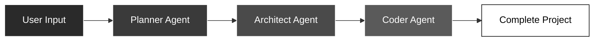

# AutoDev AI

<div align="center">


**Transform Ideas into Production-Ready Code, Instantly**

[](https://www.python.org/downloads/)
[](https://streamlit.io/)
[](https://github.com/langchain-ai/langgraph)
[](https://groq.com/)
[](LICENSE)

[**Live Demo**](https://auto-dev-ai-app-generator.streamlit.app/) • [**Quick Start**](#quick-start) • [**Features**](#key-features)

</div>

---

## Overview

**AutoDev AI** is an autonomous code generation platform powered by a multi-agent AI system. Describe your project in natural language, and watch specialized AI agents collaborate to build complete, production-ready applications.



### What Makes It Different

- Multi-Agent Architecture with three specialized AI agents
- Professional Glassmorphism UI with modern design
- Real-Time Progress Tracking
- Secure API Key Management with password-protected input
- One-Click Deployment via ZIP download
- Adaptive Complexity levels from simple to advanced

---

## Key Features

### Intelligent Multi-Agent System

1. **Planner Agent** - Analyzes requirements and creates project roadmap
2. **Architect Agent** - Designs file structure and component dependencies  
3. **Coder Agent** - Implements production-ready code with best practices

### Professional UI Design

- Glassmorphism Cards with frosted-glass aesthetic
- Dark Theme with black/white/grey color scheme
- Responsive Layout optimized for all screens
- Smooth Animations for polished experience

### Secure Configuration

- Password-protected API key input
- Session-based key storage
- Environment variable fallback support

---

## Quick Start

### Prerequisites

- Python 3.11+ ([Download](https://www.python.org/downloads/))
- Groq API Key ([Get Free Key](https://console.groq.com/keys))

### Installation

```bash
# Clone the repository
git clone https://github.com/NamanKundan/AutoDev_AI.git
cd AutoDev_AI

# Create virtual environment
python -m venv .venv

# Activate virtual environment
# Windows:
.\.venv\Scripts\activate
# macOS/Linux:
source .venv/bin/activate

# Install dependencies
pip install -r requirements.txt
```

### Configuration

**Option 1: UI Input (Recommended)**
1. Launch the app
2. Enter your Groq API key in the password field
3. Start generating projects

**Option 2: Environment File**
```bash
# Create .env file
cp .sample_env .env

# Edit .env and add your API key
GROQ_API_KEY=your_groq_api_key_here
```

### Launch

```bash
streamlit run app.py
```

Navigate to `http://localhost:8501` in your browser.

---

## Usage

1. **Enter API Key** (if not configured via environment)
2. **Set Complexity Level** - Use the slider to control project scope
   - 50-75: Simple, fast projects
   - 75-125: Moderate complexity
   - 125-200: Advanced projects
3. **Choose Quick Start Example** or enter custom description
4. **Click "Generate Project"**
5. **Watch Real-Time Progress** as agents collaborate
6. **Download ZIP** when complete

### Example Prompts

**Simple:**
```
Create a calculator with HTML, CSS, and JavaScript
```

**Moderate:**
```
Build a todo list app with local storage, dark theme, and filtering
```

**Advanced:**
```
Create a weather dashboard that fetches data from OpenWeather API, 
displays current conditions and 5-day forecast with charts
```

---

## Architecture

### Tech Stack

| Component | Technology | Purpose |
|-----------|-----------|---------|
| **Frontend** | Streamlit 1.28+ | Web UI framework |
| **AI Orchestration** | LangGraph 0.6.3 | Multi-agent workflow |
| **LLM Provider** | Groq API | Ultra-fast inference |
| **Model** | GPT-OSS-120B | Code generation |
| **State Management** | Pydantic 2.11.7+ | Data validation |

### File System Tools

- `write_file()` - Create files with content
- `read_file()` - Read existing files
- `list_files()` - List directory contents
- `get_current_directory()` - Get working directory path

---

## Troubleshooting

### Common Issues

**API Key Not Working**
- Verify key at [Groq Console](https://console.groq.com/keys)
- Check for extra spaces or quotes
- Try entering via UI instead of .env file
- Restart Streamlit after changes

**Module Import Errors**
```bash
pip install -r requirements.txt --force-reinstall
```

**Port Already in Use**
```bash
streamlit run app.py --server.port 8502
```

**Generation Timeout**
- Reduce complexity level
- Simplify your prompt
- Check internet connection

---

## Contributing

Contributions are welcome! Please follow these steps:

1. Fork the repository
2. Create a feature branch (`git checkout -b feature/amazing-feature`)
3. Commit your changes (`git commit -m 'Add amazing feature'`)
4. Push to the branch (`git push origin feature/amazing-feature`)
5. Open a Pull Request

---

## License

This project is licensed under the MIT License - see the [LICENSE](LICENSE) file for details.

---

## Acknowledgments

- [LangGraph](https://github.com/langchain-ai/langgraph) - Agent orchestration framework
- [Groq](https://groq.com/) - Ultra-fast LLM inference
- [Streamlit](https://streamlit.io/) - Web framework
- [LangChain](https://github.com/langchain-ai/langchain) - LLM integration tools

---

## Support

- **Issues**: [GitHub Issues](https://github.com/NamanKundan/AutoDev_AI/issues)
- **Discussions**: [GitHub Discussions](https://github.com/NamanKundan/AutoDev_AI/discussions)

---

<div align="center">

**Built by Naman**

[Report Bug](https://github.com/NamanKundan/AutoDev_AI/issues) • [Request Feature](https://github.com/NamanKundan/AutoDev_AI/issues)

</div>
