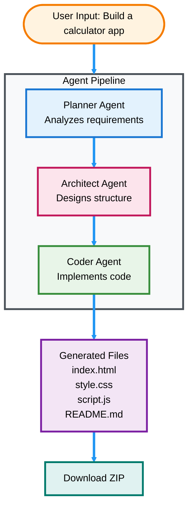

# AutoDev AI

<div align="center">

**Transform natural language into complete working projects**

[](https://autodev-ai.streamlit.app/)

[](https://www.python.org/downloads/)
[](https://streamlit.io/)
[](https://github.com/langchain-ai/langgraph)
[](https://groq.com/)

</div>

AutoDev AI is an autonomous code generation system that transforms your ideas into complete, functional software projects. Simply describe what you want to build in natural language, and watch as three specialized AI agents work together to create your entire application from scratch.

Whether you need a web app, game, calculator, or landing page, AutoDev AI handles everything - from planning and architecture to writing production-ready code. No more starting with blank files or wrestling with boilerplate code. Just describe your vision and get a complete, deployable project in minutes.



**Perfect For:** Rapid Prototyping • Learning • Client Demos • Side Projects

## 🎯 Try It Now

**🌐 [Launch Live App →](https://autodev-ai.streamlit.app/)** - No installation required!

Or run locally:

## Quick Setup

**Prerequisites:** Python 3.11+, [Groq API Key](https://console.groq.com/keys)

```bash
# Clone and setup
git clone <repository-url>
cd autodev-ai

# Install dependencies  
pip install streamlit groq langchain-groq langgraph python-dotenv

# Add your Groq API key to .env file
echo "GROQ_API_KEY=your_key_here" > .env

# Launch
streamlit run app.py
```

## Usage

1. **Launch:** `streamlit run app.py`
2. **Describe:** "Build a to-do app with dark theme"
3. **Watch:** Agents collaborate in real-time  
4. **Download:** Get your complete project ZIP

**Tech Stack:** Streamlit • LangGraph • Groq API • GPT-OSS-120B

---

## Key Features

- **Multi-Agent Collaboration** - Three specialized AI agents work together
- **Real-time Progress Tracking** - Watch your project being built step by step
- **Complete Project Generation** - Full applications with all necessary files
- **One-Click Download** - Get your project as a ready-to-deploy ZIP file
- **Complexity Control** - Adjust project scope with the recursion limit slider
- **Multiple Project Types** - Web apps, games, tools, landing pages, and more

---

## ⚠️ Troubleshooting

### Common Issues

**Issue: "Groq API key not found"**
- Ensure you've created a `.env` file with your `GROQ_API_KEY`
- Verify the API key is valid at [Groq Console](https://console.groq.com/keys)
- Restart the Streamlit app after adding the key

**Issue: "Module not found" errors**
- Make sure your virtual environment is activated
- Reinstall dependencies: `pip install streamlit groq langchain-groq langgraph python-dotenv`

**Issue: "Recursion limit exceeded"**
- Increase the recursion limit using the sidebar slider
- Try simplifying your prompt or breaking it into smaller projects
- Start with Conservative mode (50) for simple projects

**Issue: "Port already in use"**
- Stop any running Streamlit instances
- Or specify a different port: `streamlit run app.py --server.port 8502`

**Issue: "Project generation takes too long"**
- Lower the recursion limit for faster generation
- Use simpler, more specific prompts
- Check your internet connection for Groq API calls

---

## How It Works

**1. Planner Agent** analyzes your natural language request and creates a comprehensive project plan with technology choices and feature specifications.

**2. Architect Agent** converts the plan into actionable implementation steps, designing the file structure and defining dependencies.

**3. Coder Agent** executes the implementation using real file system operations, writing production-ready code for each component.

Each agent uses advanced reasoning patterns and has access to specialized tools for file management, ensuring your project is built systematically and professionally.

## Built With

[LangGraph](https://github.com/langchain-ai/langgraph) • [Groq](https://groq.com/) • [Streamlit](https://streamlit.io/) • GPT-OSS-120B

## License

This project is open source and available for personal and educational use.

---

<div align="center">

**AutoDev AI** - *Your AI Development Team*

</div>
